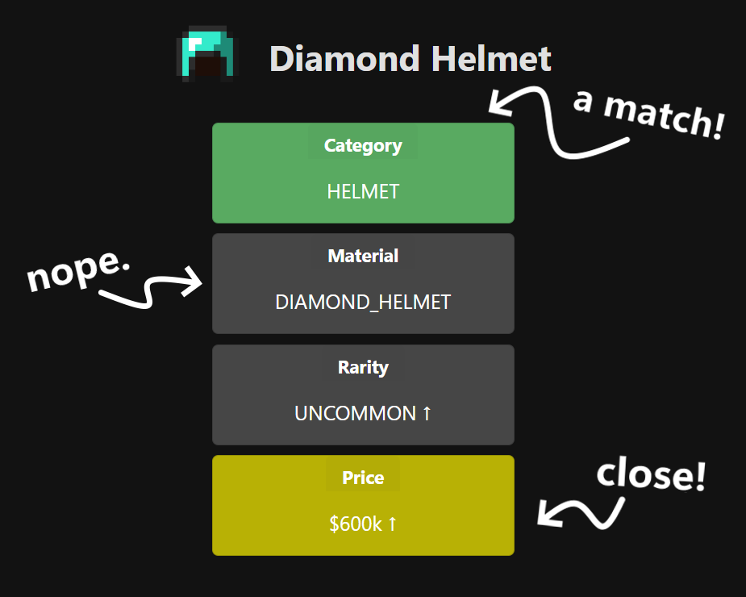

  <h1 align="center" style="font-size: 3em;">Skydle</h1>

  

## About The Project

Welcome to Skydle, the Skyblock item guessing game! You are given 10 attempts to guess the chosen item of the day and with each guess you will be given hints to help guide you in the right direction. A new item is chosen everyday at 12am EST so be sure to comeback daily to test your skills!

## Known Issues

1. Due to limited item info in the Hypixel API some items are not supported yet (they must be manually added)
2. Sometimes Coflnet API is buggy and won't return a price for some items (in this case it will result in 0)
3. A price is considered close if its within 25MIL of the actual price, this may need to be adjusted

## Release

https://skydle.vercel.app

(<a href="#readme-top">back to top</a>)

